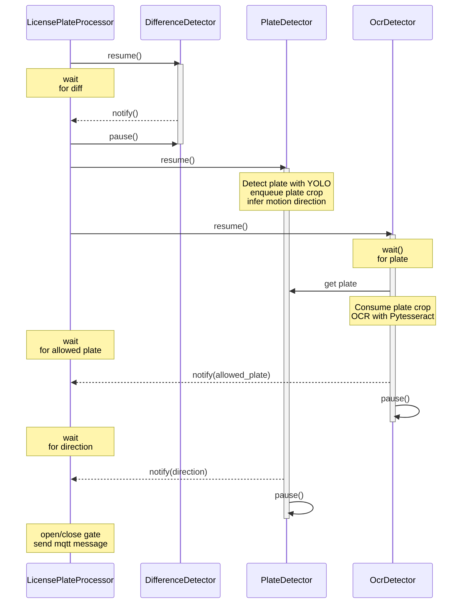
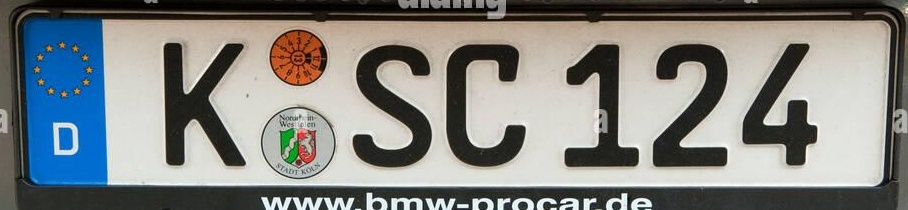
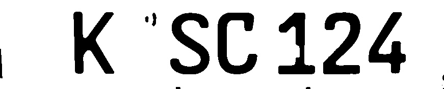
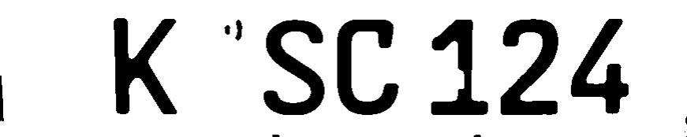
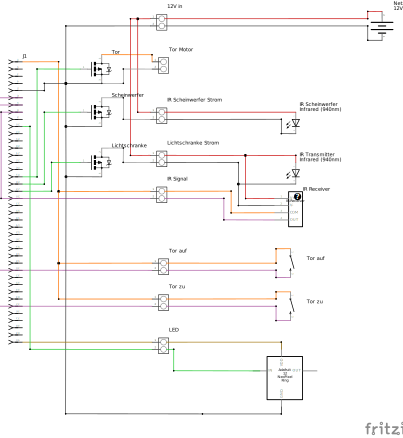
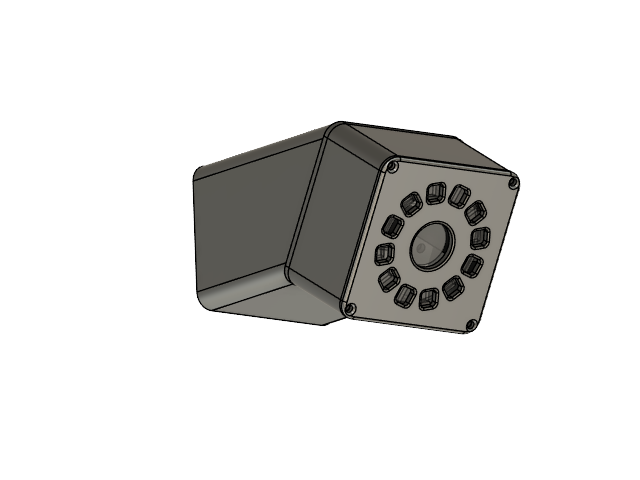
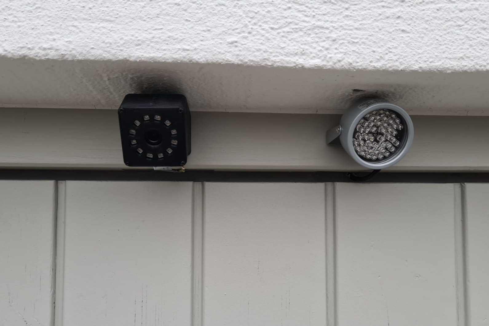
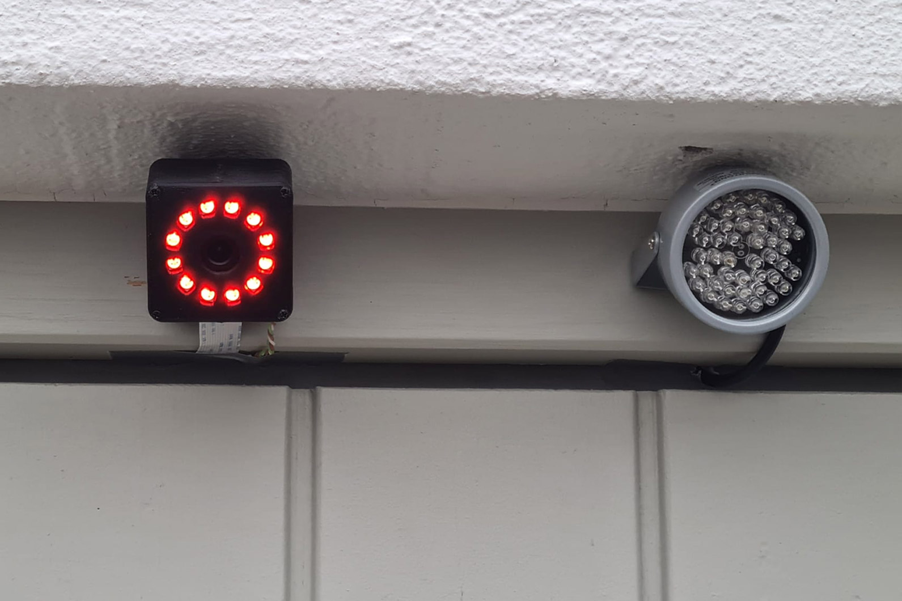

# PiGarage - Smartify your garage gate with license plate recognition

PiGarage controls a gate using a camera, IR sensors, and MQTT. It detects motion, finds license plates, performs OCR, and triggers gate actions based on allowed plates and motion direction.

- [PiGarage - Smartify your garage gate with license plate recognition](#pigarage---smartify-your-garage-gate-with-license-plate-recognition)
  - [Hardware Setup](#hardware-setup)
  - [Software component interaction](#software-component-interaction)
    - [Components](#components)
    - [OcrDetector Preprocessing Steps](#ocrdetector-preprocessing-steps)
  - [Example of image processing pipeline](#example-of-image-processing-pipeline)
  - [Raspberry Pi Shield](#raspberry-pi-shield)
  - [Housing](#housing)


## Hardware Setup

```
___________________________________________________
||          🚥          📷          🔦          ||
||     [Status LED]   [Camera]    [IR Beam]      ||
||                                               ||
||                      📟                       ||
||                 [Raspberry Pi]                ||
||                                         ⛓️    ||
||                                       [Motor] ||
||                                               ||
||                                               ||
||🚧                                          🚧||
||[IR Barrier]                       [IR Barrier]||
||_______________________________________________||
```

Legend:
- 📷 Camera and 🔦 IR Beam mounted at top center above the gate opening.
- 🚧 IR Barrier sensors placed low on left and right sides near the ground.
- 📟 Raspberry Pi
- ⛓️ Motor controlling the gate
- 🚥 Status LED indicating system state

I'm using the following hardware components:
- 📟 Raspberry Pi 4 Model B
- 📷 [IR Camera module](https://www.az-delivery.de/products/raspberry-pi-kamera-nachtsicht-infrarot-kameramodul-5mp-ov5647-webcam)
- 🔦 [IR illuminator](https://www.amazon.de/dp/B09H74YTHN)
- 🚧 [IR Barrier sensors](https://www.amazon.de/dp/B0DY465JHQ)
- 🚥 [Neopixel Ring 12x](https://www.adafruit.com/product/2853)

## Software component interaction

This section illustrates how `LicensePlateProcessor` coordinates the threads `DifferenceDetector`, `PlateDetector`, and `OcrDetector`, including their queue-based communication and pause/resume lifecycle.



### Components

- **DifferenceDetector**: Captures low-resolution frames, computes MSE, notifies on motion, then pauses.
- **PlateDetector**: Uses YOLO to detect plate crops and infers motion direction from vertical history; publishes to `detected_plates` and `detected_directions`.
- **OcrDetector**: Consumes plate crops, preprocesses and OCRs text; if text matches `allowed_plates`, publishes to `detected_ocrs` and pauses.
- **LicensePlateProcessor**: Orchestrates pause/resume, waits for motion, then concurrently runs plate and OCR; reads `detected_ocrs` and `detected_directions` with timeouts, triggers callbacks.

### OcrDetector Preprocessing Steps

In order to improve OCR accuracy, the following preprocessing steps are applied to the plate crops before passing them to Pytesseract:

1. Mask non-plate areas to focus on text and reduce to black and white
   (See [./src/pi_garage/ocr_detector.py::cv2_mask_non_plate](./src/pi_garage/ocr_detector.py))
2. Fix perspective distortion
   (See [./src/pi_garage/ocr_detector.py::cv2_fix_perspective](./src/pi_garage/ocr_detector.py))


## Example of image processing pipeline

1. Original image from camera (from huggingface model page):
   

2. Detected license plate region (`pigarage-plate-detector ./docs/plate-original.jpg --output ./docs/plate-crop.jpg`):
   

3. Masked non-plate areas (`pigarage-ocr-detector ./docs/plate-crop.jpg mask --output ./docs/plate-masked.jpg`):
   

4. Fix perspective distortion (`pigarage-ocr-detector ./docs/plate-masked.jpg perspective --output ./docs/plate-fixed-perspective.jpg`):
   

5. Pytesseract Result:
   ```
   KSC124
   ```

## Raspberry Pi Shield

Wiring diagram for connecting the components to the Raspberry Pi using a custom shield:



See [docs/garage.fzz](docs/garage.fzz) for the Fritzing source file.

## Housing

I designed a custom housing for the camera and the LED ring using Fusion 360.
The source files can be found under [docs/garage-housing.f3d](docs/garage-housing.f3d).
Here are some pictures of the housing:




